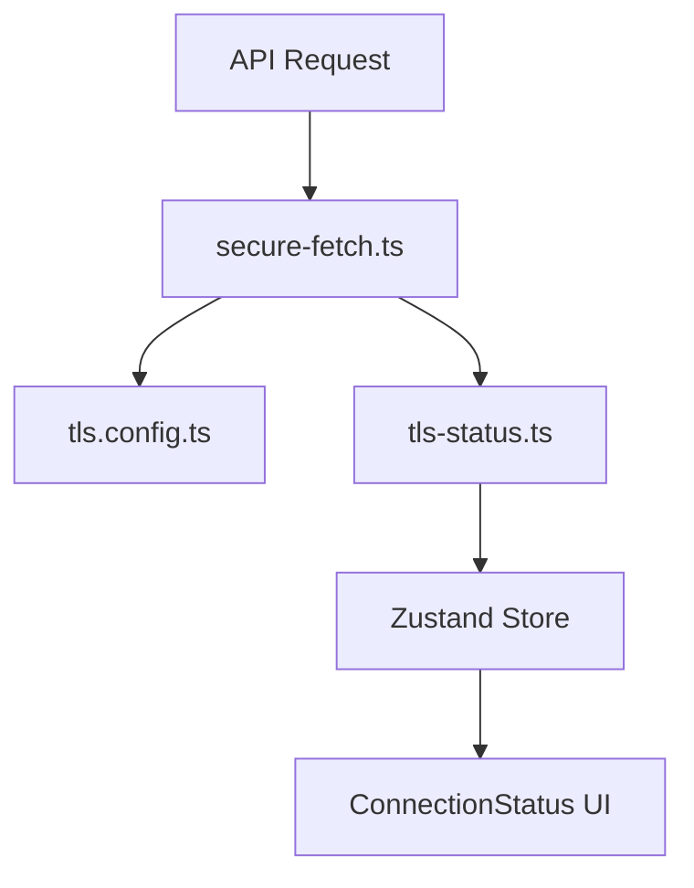

// filepath: v:\Projects\Personal\RA\cider-code\cider-code-wh-app\docs\tls-integration-guide.md
# Руководство по интеграции TLS в приложении

## Обзор

Данное руководство описывает, как интегрированная система TLS работает в приложении и как она взаимодействует с пользовательским интерфейсом и Zustand-хранилищем.

## Архитектура TLS-интеграции

### Компоненты системы

1. **TLS Configuration** (`src/config/tls.config.ts`):
   - Управляет настройкой и загрузкой сертификатов
   - Создаёт HTTPS-агент для защищённых соединений

2. **TLS Status Tracker** (`src/config/tls-status.ts`):
   - Отслеживает состояние TLS соединений
   - Сохраняет статистику и информацию о сертификатах

3. **Secure Fetch** (`src/config/secure-fetch.ts`):
   - Обёртка вокруг стандартного fetch для поддержки TLS
   - Записывает успешные и неудачные соединения

4. **Zustand Store** (`src/store/index.ts`):
   - Хранит состояние TLS соединения
   - Предоставляет методы для обновления и получения статуса

5. **Компонент ConnectionStatus** (`src/components/ConnectionStatus.tsx`):
   - Отображает текущий статус TLS соединения
   - Предоставляет интерфейс для просмотра деталей сертификата

### Поток данных



## Использование TLS в коде

### Запросы к API

Запросы к API автоматически защищены TLS, если URL начинается с `https:`. Для этого используется `secure-fetch.ts`, который применяет соответствующий HTTPS-агент.

```typescript
// Безопасный запрос к API
const response = await secureFetch(url, options);
```

### Обновление статуса TLS

После каждого запроса к API обновляется информация о статусе TLS-соединения:

```typescript
// После успешного запроса
recordSuccessfulConnection();

// После неудачного запроса
recordFailedConnection(errorMessage);
```

### Zustand Store и хуки

Для обновления и получения информации о TLS используется Zustand store:

```typescript
// Получение статуса TLS
const { tlsStatus, tlsStatusLoading, tlsStatusError } = useStore();

// Обновление статуса TLS
fetchTlsStatus();
```

Также существуют специализированные хуки:

```typescript
// Хук для получения и периодического обновления статуса TLS
const { tlsStatus, tlsStatusLoading, refreshTlsStatus } = useTlsStatus();

// Хук для инициализации API и TLS
useApiInitialization();
```

### ConnectionStatus компонент

Компонент отображает текущий статус TLS-соединения:

```tsx
// Добавление компонента ConnectionStatus в любое место приложения
<ConnectionStatus />
```

## Диагностика проблем

### Проверка статуса TLS

В пользовательском интерфейсе:
- Зеленый значок щита - успешное TLS соединение
- Желтый значок щита с восклицательным знаком - проблемы с сертификатом
- Красный значок - ошибка соединения
- Серый значок - неизвестный статус

### Логирование

Все операции и ошибки TLS записываются в консоль и доступны через DevTools.

## Сертификаты

Сертификаты расположены в директории `certs/`:
- `cert.pem` - сертификат
- `key.pem` - приватный ключ

Подробнее о настройке сертификатов см. `docs/tls-setup.md` и `docs/tls-with-letsencrypt.md`.
